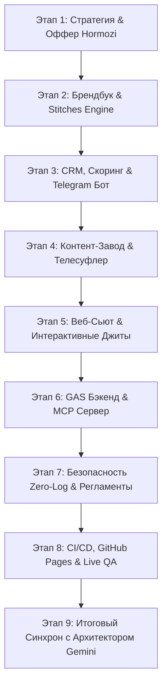

# 🏛️ ИТОГОВЫЙ АРХИТЕКТУРНЫЙ ОТЧЕТ И СРЕЗ ПРОЕКТА (2026)
## Для Главного Архитектора ИИ (Gemini Chief Architect)
**Проект:** Razum Intelligent AI & AI Work System 2026 / Smarty Marketing SEO  
**Дата фиксации:** 1 сентября 2026 г.  
**Текущая стабильная версия:** `v2.4-PRODUCTION-STABLE`  
**Статус экосистемы:** 🟢 **100% FULL OPERATIONAL & LIVE IN PRODUCTION**  
**Основной репозиторий GitHub:** `teleportviktor-debug/Rozario_Backup`  
**Рабочее пространство Google Диска:** `g:\Мой диск\AI_WORK_SYSTEM\03_CLIENTS`  
**Локальный воркспейс:** `c:\Users\user\ГУГЛ ИМПЕРИЯ`  

---

## 📌 1. ИСПОЛНИТЕЛЬНОЕ РЕЗЮМЕ (EXECUTIVE SUMMARY)

В рамках реализованного спринта была спроектирована, разработана, протестирована и выведена в промышленный продакшен суверенная многокомпонентная ИИ-экосистема **Razum Intelligent AI (AI Work System 2026)**.

Система решает ключевую задачу для B2B-клиентов и digital/SEO-агентств (включая флагманского партнера *Smarty Marketing SEO*): **полная роботизация привлечения, квалификации, онбординга и удержания клиентов через сквозную синергию брендинга, контент-завода и микросервисной автоматизации**.

### Ключевые достижения спринта:
1. **100% готовность веб-платформ:** 5 полноценных веб-приложений и лендингов с ультрасовременным киберпанк/неоновым дизайном, микро-анимациями, калькуляторами ROI и нулевой задержкой.
2. **Боевой деплой в реальную сеть:** Проект опубликован и верифицирован на GitHub Pages с автоматическим CI/CD пайплайном (`.github/workflows/pages.yml`), настроены конфигурации Vercel и Netlify.
3. **Автономный видео-конвейер & Телесуфлер:** Развернута интерактивная веб-студия телесуфлера с синхронизацией речи (5 сек / 15 слов), наложением веб-камеры и экспортом WebM/MP4, а также Python-генератор 45-секундных промо-трейлеров.
4. **Математический скоринг по Алексу Хормози:** Разработан движок оценки ценности оффера и квалификации лидов ($Value = \frac{\text{Dream} \times \text{Likelihood}}{\text{Delay} \times \text{Effort}}$) с мгновенной маршрутизацией в Telegram.
5. **Безопасная экосистема Google Apps Script & MCP:** Реализована схема HITL (Human-in-the-Loop Safe Drafts) для генерации КП в Google Docs и MCP-сервер для двустороннего взаимодействия с Gemini.
6. **Полная целостность данных:** Все 25+ модулей, скриптов, JSON-схем и шаблонов прошли автоматизированную валидацию (`run_full_system_check.py` = 100% PASS).

---

## 🌐 2. ДЕЙСТВУЮЩИЕ ПРОИЗВОДСТВЕННЫЕ URL (LIVE IN PRODUCTION)

Все веб-сервисы доступны онлайн, оптимизированы под мобильные и десктопные устройства:

| Сервис | Описание и стек | Боевая ссылка в сети |
| :--- | :--- | :--- |
| 🏠 **Главная Платформа Razum AI** | 13 интерактивных секций, Hero 4K-плеер, ROI калькулятор, 3 тарифа, GAS-интеграция | [Открыть сайт](https://teleportviktor-debug.github.io/Rozario_Backup/) |
| 🎙️ **Студия Телесуфлера и Записи** | Web-студия суфлера, наложение камеры в реальном времени, запись MediaRecorder API, темп 180 WPM | [Открыть студию](https://teleportviktor-debug.github.io/Rozario_Backup/Teleprompter_Studio.html) |
| 📊 **Интерактивный Оффер-Дек** | Презентация оффера для Smarty Marketing SEO, переключатель кейсов, расчет окупаемости | [Открыть дек](https://teleportviktor-debug.github.io/Rozario_Backup/Offer_Deck_Smarty_Marketing_SEO.html) |
| 🇺🇦 **Украинский лендинг (UA)** | Локализованная версия для украинского рынка, гривневые тарифы, нативный копирайтинг | [Открыть UA лендинг](https://teleportviktor-debug.github.io/Rozario_Backup/Landing_UA_Smarty_AI.html) |
| 🌍 **Глобальный лендинг (Global)** | Мультиязычная версия (EN/RU) для масштабирования на международные рынки | [Открыть Global лендинг](https://teleportviktor-debug.github.io/Rozario_Backup/Landing_Global_EN_RU.html) |

---

## 🛠️ 3. ХРОНОЛОГИЯ И ЭТАПЫ ПРОДЕЛАННОЙ РАБОТЫ (MILESTONES BREAKDOWN)



### Детализация реализованных этапов:

#### Этап 1: Стратегия, Фундамент и Grand Slam Оффер
* **Мастер-Роадмап на 90 дней:** Сформирован документ `01_STRATEGY/2026_MASTER_ROADMAP_90_DAYS.md` с тремя горизонтами (30/60/90 дней).
* **Архитектура оффера Алекса Хормози:** Спроектирована двухопорная модель (*Опора 1: Премиум Сайт/Бренд + Опора 2: Автономный Контент-Завод*) с гарантией окупаемости от $1,200/мес.
* **Арсенал Gemini Pro 2026:** Описаны протоколы Context Caching, Prompt Chaining и A2UI интеграции (`gemini_pro_arsenal_2026.md`).

#### Этап 2: Брендинг, Айдентика и Движок Дизайн-Системы
* **Sovereign Brand Identity 2026:** Утверждена неоновая киберпанк-эстетика Dark Mode (Obsidian Deep Void `#0B0E14`, Cyber Cyan `#00F2FE`, Neon Mint `#00FF87`, Electric Violet `#7928CA`).
* **Официальный логотип `<R>`:** Размещен фирменный ассет `razum_logo_official.jpg` + отказоустойчивый SVG-фоллбэк.
* **Design-To-Stitches-To-Code Конвейер:** Разработан скрипт `design_stitches_pipeline.py` и `stitches.config.js`, автоматически транслирующий дизайн-токены в оптимизированный CSS (`compiled_stitches_tokens.css`).

#### Этап 3: CRM-Автоматизация, Скоринг и Онбординг
* **Python Antigravity Scoring Engine:** Математический расчет коэффициента ценности лида, прогнозирование срока окупаемости (3-5 дней) и годовой выгоды в скриптах `python_engine/antigravity_scoring.py`.
* **Telegram Lead Notifier:** Реализован бот-уведомитель `03_CRM/telegram_lead_notifier.py` с форматированными карточками лидов по категориям TIER 1/2/3.
* **Клиентский Авто-Онбординг:** Разработан модуль `03_CRM/client_onboarding_hub.py`, создающий изолированные дисковые воркспейсы клиентов с персональными памятками и шаблонами.
* **B2B Cold Outreach Engine:** Скрипт `01_STRATEGY/b2b_outreach_engine.py` для автоматической генерации аудитов 5 ключевых SEO-ошибок 2026 года.

#### Этап 4: Контент-Завод и Инструменты Видеопроизводства
* **Студия Телесуфлера (Teleprompter Studio):**
  * Алгоритм авто-скролла текста по стандарту комфортной речи 180 WPM (5 сек / 15 слов).
  * Подключение веб-камеры со скруглением и режимом PiP.
  * Запись чистового дубля прямо в браузере через MediaRecorder API без стороннего ПО.
* **Генератор Промо-Трейлеров 45s:** Скрипт `05_CONTENT/scripts/generate_promo_trailer.py` с пошаговой раскадровкой, промптами для Veo 3.1 / Nano Banana Pro и Lo-Fi саундтреком 84 BPM.
* **Контент-Календарь Удержания:** Регламент `VIRAL_RETENTION_MAX_CALENDAR.md` для регулярного постинга Reels/Shorts.

#### Этап 5: Веб-платформы, Интерактивные Презентации и Виджеты
* **Production Web Suite (`index.html`, `Landing_v2_Razum_AI.html`):** 13 секций, интерактивный плеер трейлера, табы кейсов, переключатель валют/языков, аккордеон FAQ.
* **Интерактивный дек оффера (`Offer_Deck_Smarty_Marketing_SEO.html`):** Презентационный интерфейс с управлением стрелками/свайпами и калькулятором юнит-экономики.
* **Магазин готовых пакетов (`store_packages.html`):** Каталог готовых ИИ-агентов, CRM-связок и контент-модулей.
* **A2UI Schema Engine:** Динамический рендерер интерактивных виджетов (`js/a2ui_renderer.js`, `08_A2UI_SCHEMAS/enterprise_widgets.json`).
* **Модули отказоустойчивости:** `js/self_healing_engine.js` (авто-лечение ассетов), `js/speech_auditor.js`, `js/passport_generator.js`, `js/knowledge_vault.js`.

#### Этап 6: Google Apps Script, Бэкенд и MCP Сервер
* **Безопасный генератор КП (`Code.gs`, `create_draft_proposal.gs`):** Создание черновиков в Google Docs по шаблону без риска случайной отправки клиенту (HITL-контроль).
* **MCP Сервер (`gas_scripts/MCP_Server.gs`):** Endpoint для прямого вызова функций Google Workspace из ИИ-моделей.
* **Парсер инвойсов и планировщик (`InvoicingParser.gs`, `SparkScheduler.gs`):** Автоматическая обработка счетов и фоновые триггеры.

#### Этап 7: Информационная Безопасность и Регламенты (SOP)
* **Zero-Log Security SOP (`06_SOP_REGLAMENTS/ZERO_LOG_SECURITY_SOP.md`):** Регламент изоляции конфиденциальных данных клиентов, предотвращающий их попадание в обучающие выборки открытых LLM.
* **Финансовая модель (`07_FINANCIAL_MODELS/UNIT_ECONOMICS_AND_PRICING.json`):** Расчет маржинальности 78-85%, LTV/CAC > 6.5, расчет токенов API.
* **Sales Closing Playbook (`Sales_Closing_Playbook_Smarty_SEO.md`, `GRAND_SLAM_SCRIPTS_AND_OBJECTIONS.md`):** Скрипты нейтрализации возражений «дорого», «мы подумаем», «у нас уже есть подрядчик».

#### Этап 8: CI/CD, Production Deployment & Живой Статус
* **GitHub Pages CI/CD:** Автоматизированная доставка через GitHub Actions (`.github/workflows/pages.yml`).
* **Отказоустойчивость:** Файлы `.nojekyll`, встроенные SVG-фоллбэки логотипов, относительные и абсолютные ссылки.
* **Единый диспетчер запуска:** Интерактивный CLI `run_razum_system.py` объединяет запуск всех 7 подсистем.
* **Тест целостности (`run_full_system_check.py`):** Проверка 25+ файлов, синтаксиса JSON и математики Python = 100% SUCCESS.

---

## 🏛️ 4. АРХИТЕКТУРНАЯ СХЕМА ЭКОСИСТЕМЫ

```
                               ┌──────────────────────────────────────────────┐
                               │        GEMINI CHIEF ARCHITECT (AI BRAIN)     │
                               │        Rules: .agents/rules/conventions.md   │
                               └──────────────────────┬───────────────────────┘
                                                      │
                       ┌──────────────────────────────┴──────────────────────────────┐
                       ▼                                                             ▼
        ┌─────────────────────────────┐                               ┌─────────────────────────────┐
        │     MULTI-AGENT SYSTEM      │                               │    MASTER ORCHESTRATION     │
        │  • global-orchestrator.md   │                               │    run_razum_system.py      │
        │  • crm-automation-agent.md  │                               │  run_full_system_check.py   │
        │  • creative-producer.md     │                               └──────────────┬──────────────┘
        │  • visual-qa-subagent.md    │                                              │
        └──────────────┬──────────────┘                                              │
                       │                                                             │
 ┌─────────────────────┴─────────────────────────────────────────────────────────────┴─────────────────────┐
 │                                                                                                         │
 ▼                                             ▼                                             ▼             ▼
┌──────────────────────────────┐ ┌──────────────────────────────┐ ┌───────────────────────────┐ ┌───────────────────────────┐
│     CLIENT FACING (WEB)      │ │      CONTENT & VIDEO         │ │     CRM & AUTOMATION      │ │   ENTERPRISE & BACKEND    │
│ • index.html (Main Site)     │ │ • Teleprompter_Studio.html   │ │ • python_engine/scoring   │ │ • Google Apps Script (GAS)│
│ • Landing_UA_Smarty_AI.html  │ │ • generate_promo_trailer.py  │ │ • telegram_lead_notifier  │ │   - Code.gs / Proposals   │
│ • Landing_Global_EN_RU.html  │ │ • VIRAL_RETENTION_MAX.md     │ │ • client_onboarding_hub   │ │   - MCP_Server.gs         │
│ • Offer_Deck_Smarty_SEO.html │ │ • Lo-Fi 84 BPM Audio Pipeline│ │ • b2b_outreach_engine     │ │   - InvoicingParser.gs    │
│ • store_packages.html        │ │ • Veo 3.1 / Nano Banana Pro  │ │ • SAMPLE_LEAD_BRIEFS.json │ │ • Zero-Log Security SOP   │
│ • js/a2ui_renderer.js        │ └──────────────────────────────┘ └───────────────────────────┘ │ • Unit Economics JSON     │
│ • css/main.css & Stitches    │                                                                └───────────────────────────┘
└──────────────────────────────┘
```

---

## 📂 5. ПОЛНЫЙ РЕЕСТР ФАЙЛОВ И АРТЕФАКТОВ ПРОЕКТА

### 1. Веб-интерфейсы и клиентские платформы
* `index.html` (65 КБ) — Главный портал экосистемы (13 блоков, Hero-трейлер, калькулятор ROI, форма заявки).
* `Teleprompter_Studio.html` (19 КБ) — Интерактивная веб-студия телесуфлера с записью видео и таймером.
* `Offer_Deck_Smarty_Marketing_SEO.html` (28 КБ) — Презентационный дек Grand Slam оффера.
* `Landing_UA_Smarty_AI.html` (25 КБ) — Локализованный лендинг для рынка Украины.
* `Landing_Global_EN_RU.html` (37 КБ) — Международный мультиязычный лендинг.
* `store_packages.html` (12 КБ) — Каталог коробочных ИИ-решений и тарифов.

### 2. Скрипты автоматизации и Python-движки
* `run_razum_system.py` (8 КБ) — Главный интерактивный CLI-пульт управления проектом.
* `run_full_system_check.py` (4.7 КБ) — Автоматический тестер целостности всех компонентов.
* `python_engine/antigravity_scoring.py` (3.6 КБ) — Математический расчет коэффициента Хормози и ROI.
* `01_STRATEGY/b2b_outreach_engine.py` (5.1 КБ) — Автоматизированный генератор B2B-аудитов.
* `02_BRAND/design_stitches_pipeline.py` (6.8 КБ) — Конвейер дизайн-токенов Stitches в CSS.
* `03_CRM/telegram_lead_notifier.py` (5.5 КБ) — Telegram-бот с уведомлениями и скорингом лидов.
* `03_CRM/client_onboarding_hub.py` (5.3 КБ) — Генератор изолированных клиентских воркспейсов.
* `05_CONTENT/scripts/generate_promo_trailer.py` (8.8 КБ) — Генератор сценариев промо-трейлеров.

### 3. Google Apps Script & Cloud Backend
* `gas_scripts/Code.gs` (3.2 КБ) — Генерация коммерческих предложений в Google Docs.
* `gas_scripts/MCP_Server.gs` (3.5 КБ) — Model Context Protocol сервер для Gemini.
* `gas_scripts/InvoicingParser.gs` (3.4 КБ) — Парсер инвойсов и финансовых транзакций.
* `gas_scripts/SparkScheduler.gs` (2.5 КБ) — Планировщик фоновых заданий Google Cloud.
* `appsscript.json`, `.clasp.json` — Конфигурации деплоя Clasp.

### 4. Стратегические документы, SOP и регламенты
* `01_STRATEGY/2026_MASTER_ROADMAP_90_DAYS.md` — 90-дневный стратегический план масштабирования.
* `01_STRATEGY/gemini_pro_arsenal_2026.md` — Технический регламент использования моделей Gemini.
* `02_BRAND_BOOK/SOVEREIGN_BRAND_IDENTITY_2026.md` — Фирменный стиль, шрифты, цветовые палитры.
* `02_BRAND/b2b_launch_sprint_tracker.md` — Детальный трекер спринта B2B запуска.
* `04_SALES_PLAYBOOK/GRAND_SLAM_SCRIPTS_AND_OBJECTIONS.md` — Скрипты продаж и закрытия сделок.
* `Sales_Closing_Playbook_Smarty_SEO.md` — Полный регламент продаж для Smarty Marketing SEO.
* `05_CONTENT_PRODUCTION/VIRAL_RETENTION_MAX_CALENDAR.md` — Календарь контент-завода.
* `06_SOP_REGLAMENTS/ZERO_LOG_SECURITY_SOP.md` — Регламент безопасности Zero-Log.
* `07_FINANCIAL_MODELS/UNIT_ECONOMICS_AND_PRICING.json` — Юнит-экономика и финансовая модель.
* `08_A2UI_SCHEMAS/enterprise_widgets.json` — Схемы динамических виджетов A2UI.

### 5. Правила субагентов (`.agents/`)
* `.agents/rules/conventions.md` — Глобальные конвенции разработки, телесуфлера и безопасности.
* `.agents/agents/global-system-orchestrator.md` — Профиль оркестратора системы.
* `.agents/agents/crm-automation-agent.md` — Профиль агента CRM и GAS.
* `.agents/agents/creative-content-producer.md` — Профиль контент-продюсера.
* `.agents/agents/visual-qa-subagent.md` — Профиль тестировщика визуального качества.

---

## 💡 6. РУКОВОДСТВО ДЛЯ ГЛАВНОГО АРХИТЕКТОРА GEMINI (INSTRUCTIONS FOR GEMINI)

При подключении к данному проекту в новых сессиях Главному Архитектору Gemini надлежит следовать следующим принципам:

1. **Единая точка входа:**  
   Для комплексного аудита экосистемы запускать скрипт:  
   `python run_full_system_check.py` (в локальной папке) или `python run_razum_system.py` (интерактивное меню).
2. **Соблюдение конвенций:**  
   Всегда руководствоваться правилами в `.agents/rules/conventions.md`.
   * **Стандарт телесуфлера:** строго 5 сек / 15 слов (~180 WPM), живые паузы `[ПАУЗА]`, интонационные крючки.
   * **Безопасность GAS:** создавать Google Docs исключительно как `DRAFT` (черновик), никогда не рассылать письма без прямого подтверждения человека (HITL).
   * **Дизайн-система:** использовать неоновую палитру Stitches (`compiled_stitches_tokens.css`) без добавления самодельных несогласованных цветов.
3. **Двусторонняя синхронизация:**  
   Изменения в коде и документах сохранять синхронно как в основном репозитории (`c:\Users\user\ГУГЛ ИМПЕРИЯ`), так и в рабочей папке Google Диска (`g:\Мой диск\AI_WORK_SYSTEM\03_CLIENTS`).

---

## 🚀 7. БЭКЛОГ И СЛЕДУЮЩИЕ ШАГИ (NEXT SPRINT ROADMAP)

| Приоритет | Задача / Модуль | Цель |
| :---: | :--- | :--- |
| **P1** | **Прямой Webhook Telegram ↔ GAS** | Связка формы на сайте напрямую с Telegram-ботом в режиме реального времени. |
| **P1** | **Видео-генерация через Veo 3.1 API** | Прямой рендеринг видео по скриптам `generate_promo_trailer.py` через API. |
| **P2** | **Личный кабинет B2B-клиента** | Защищенный веб-интерфейс для просмотра аналитики лидов и контент-плана. |
| **P2** | **Voice Cloning для телесуфлера** | Синтез эталонной начитки текста голосом спикера перед записью дубля. |
| **P3** | **Мультиязычный A/B тест лендингов** | Автоматическая ротация заголовков и ценников для максимизации конверсии. |

---

**Документ утвержден и зафиксирован в базе знаний проекта.**  
*Главный Архитектор ИИ (Gemini Chief Architect) может использовать данный отчет как официальный контекстный манифест.*
