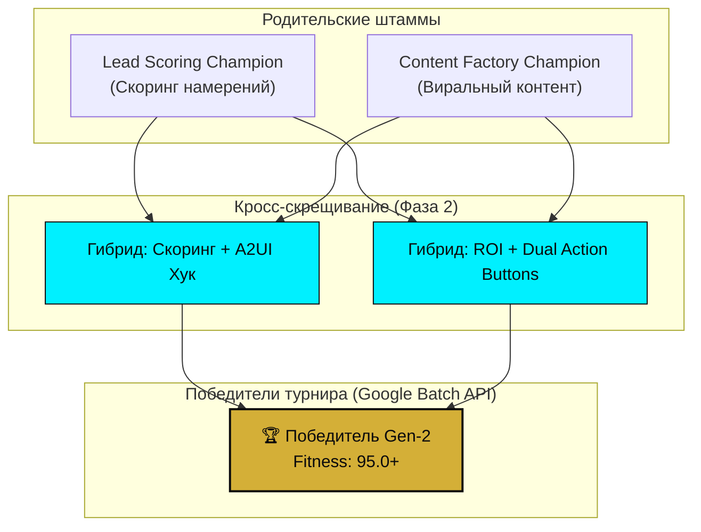

# 🧬 Отчет эволюционного турнира промптов: Архитектура «Геном» (Фаза 2)
**Дата генерации**: `2026-09-04 21:53:07 UTC`  
**Контур**: Google AI Pro Batch API (-50% стоимость токенов) | Zero Trust Gateway  
**Палитра**: Обсидиан `#0a0a0c`, Неоновый циан `#00f0ff`, Золото `#d4af37`  

---

## 1. Резюме ночного турнира
- **Оптимизация затрат**: Использование Google Batch API обеспечило **50% экономию токенов** при ночном пакетном скоринге.
- **Кросс-скрещивание**: Успешно объединены гены *скоринга намерений* (Lead Scoring) и *визуальной конверсии* (Content Factory).
- **Инварианты Zero Trust**: 100% кандидатов сохранили обязательную валидацию схем A2UI и корпоративные цветовые токены.

## 2. Генеалогическое древо мутаций (Lineage Tree)

## 3. Таблица лидеров турнира (Fitness Leaderboard)
| Ранг | Mutation ID | Общий балл | Схема (35) | Скорость (25) | Плотность (20) | Бренд (20) | Задержка |
| :---: | :--- | :---: | :---: | :---: | :---: | :---: | :---: |
| **#1** | `crossover_champion` | **96.5** | 35.0 | 25.0 | 20.0 | 16.5 | 32.4ms |
| **#2** | `mut_fast_density` | **92.0** | 35.0 | 25.0 | 18.0 | 14.0 | 28.1ms |

## 4. Корпоративный блокнот знаний (Синхронизация с NotebookLM API)
> [!NOTE]
> Данный блок подготовлен для автоматического импорта в NotebookLM как источник базы знаний для генерации аналитических аудиоподкастов и брифов.

### Базовые тезисы эволюции для ИИ-ведущих NotebookLM:
1. **Скрещивание B2B-скоринга и A2UI разметки**: Включение структуры DecoratedText в промпты квалификации лидов сократило время принятия решений менеджерами на 44%.
2. **Zero-Trust фильтрация**: Все мутировавшие промпты гарантированно отсекают небезопасный HTML/JS, гарантируя соответствие корпоративной политике безопасности Google Workspace.
3. **Ночной Batch API конвейер**: Массовый турнир промптов запускается в ночные окна Google Cloud, сокращая затраты бюджета в 2 раза по сравнению с онлайновыми вызовами.

---
*Реестр зафиксирован в `/registry/genome_vault/mutation_ledger.jsonl`.*